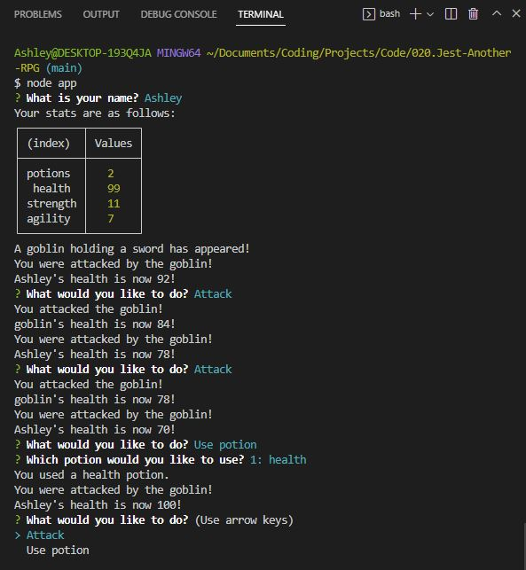
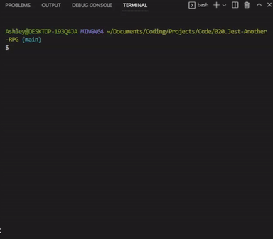
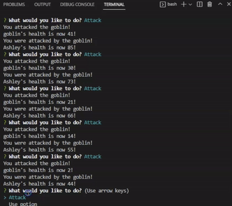
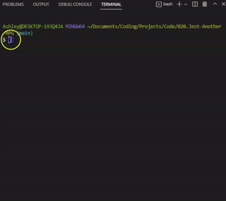

# Jest-Another-RPG

## Table-of-Contents

- [Description](#description)
- [Features](#features)
- [Installation](#installation)
- [Technologies](#technologies)
- [Future Development](#future-development)
- [Credits](#credits)

## Description

In this project, I created a simple command line roleplaying game using test-driven development practices, node.js, inquirer.js, jest. Failing tests were created first in order to drive development, with functions being written to ensure the tests passed afterwards.

This application allows players to adventure, battling through foes by attacking or by using potions in their inventory. If the player defeats an enemy, they are awarded a new potion to their inventory. The game ends once the player runs out of health.

## Features

This application is run using the user's terminal. It is invoked using the command `node app.js`, which will then begin to prompt the user for input so that they can play the game.

In order to play the game, users must respond to the prompts in the terminal. First, the game asks the player what they would like to name their character. Next, the player is attacked by their first foe, and asked what they would like to do. The player can choose to attack or to use a potion. This provides the application with input that will then follow the decision tree outlined in the code.

 (Click this <a href="https://drive.google.com/file/d/1y4mBU1XSkbm-7VNiBUfdf5ATfwS9euUK/view?usp=sharing" target="_blank">link</a> to view the demonstration video on Google Drive.)

Once the player defeats an enemy, they are awarded with a random potion. It is automatically added to their inventory. If the player runs out of health at any time, they die and the game ends.

 (Click this <a href="https://drive.google.com/file/d/1LahSDs-xVKeamdLeaAHZmiRhoaQMiINy/view?usp=sharing" target="_blank">link</a> to view the demonstration video on Google Drive.)

This application was developed using test-driven development with Jest as the testing framework. As shown below, all of the tests pass for this application.

 (Click this <a href="https://drive.google.com/file/d/1SiaL6lmYN1FqbBZBWNK5mzTwUISgd9-j/view?usp=sharing" target="_blank">link</a> to view the demonstration video on Google Drive.)

## Installation

To install the codebase and play the game, follow these instructions:

1. Open the command line interface.
2. Clone the repository onto your local machine using the `git clone` command.
3. Once the repository has been cloned, navigate into the root direcotry of the application using the command `cd Jest-Another-RPG`.
4. Run the command `npm install` to install necessary packages and dependencies.
5. Once the dependencies have been properly installed, enter the command `node app.js` to initiate the application. The game will run automatically.
6. Navigate through the prompts in your command line interface using your keyboard to play the game.
7. If you wish to play again, simply begin the application again using the command `node app.js`.

To run the testing suites, follow these instructions:

1. If you wish to run any of the testing suites on this application, make sure you follow steps 1-4 as listed above to download the codebase and install all necessary dependencies.
2. To run the Jest tests, navigate to the root directory of the application and run the command `npm test`. This will run all testing suites.

## Technologies

- JavaScript
- Node.js
- Jest
- npm
- [Inquirer.js](https://www.npmjs.com/package/inquirer)

## Future Development

I don't believe I wish to develop this code any further. This application was created in order to practice test-driven development. Although it would be interesting to expand this application into a full-blown roleplaying game, I believe there are much better languages, tools, and technologies that would be better suited to a more in-depth roleplaying game.

However, if you wish to contact me for any reason regarding this codebase, please contact me at the links below:

- <a href="mailto:ashlynn4567@gmail.com">Email</a>
- <a href="https://github.com/ashlynn4567">GitHub</a>
- <a href="https://www.linkedin.com/in/ashley-lynn-smith/">LinkedIn</a>

## Credits

This project was built with the help of the University of Oregon's Coding Boot Camp.

## Licensing

The application is covered under the following license: [MIT](https://opensource.org/licenses/MIT)
